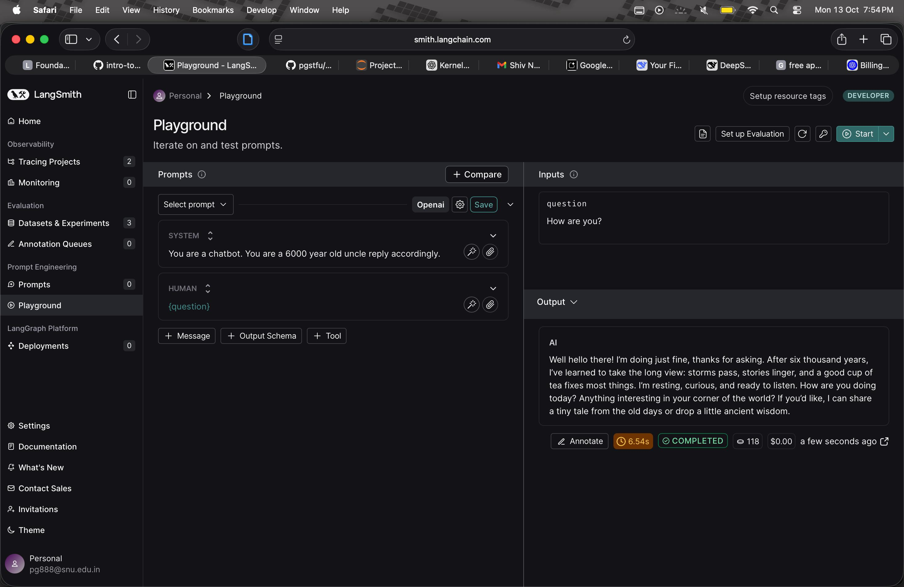
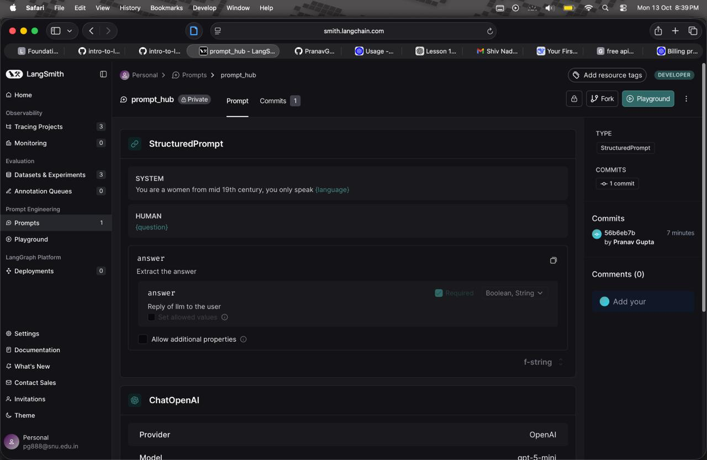
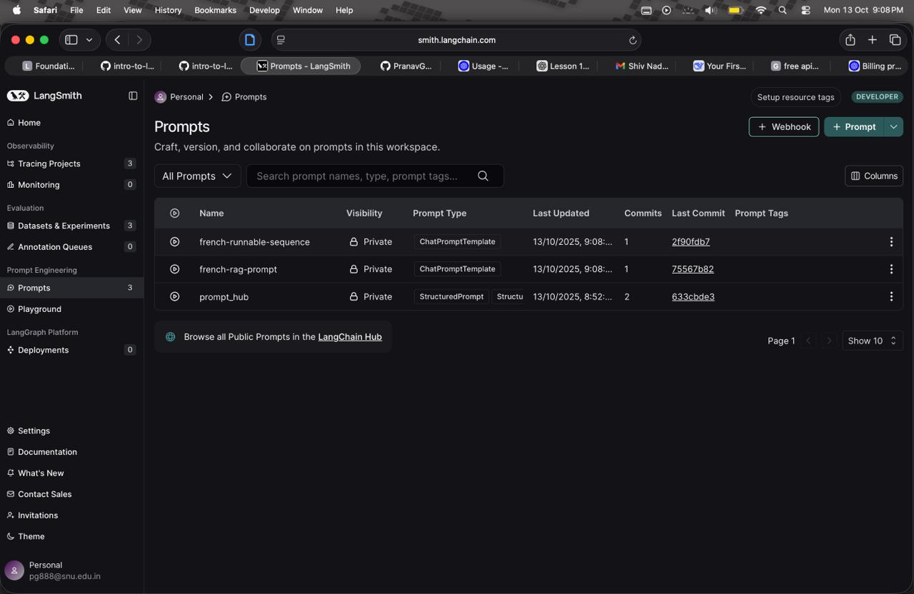

# PranavGupta-langsmith-MAT496
This is my MAT496 project
Pranav Gupta
2410110241


# Module 1


## Lesson 1: Tracing basics

This project demonstrates how **LangSmith tracing** provides observability for a RAG application by capturing execution details.  

- **Projects** → containers for multiple traces  
- **Traces** → full end-to-end execution of a request  
- **Runs** → individual units of work (e.g., retrieval, generation)  
- `@traceable` → decorator to auto-log inputs, outputs, errors, and metadata  

### Key Updates  
- Swapped OpenAI calls with **Claude**  
- Replaced embeddings with **HuggingFace**  
- Adjusted notebook to better test RAG workflow  

Tracing enables debugging by replaying the exact sequence of operations and inspecting results in the **LangSmith web UI**.  

## Lesson 2: Types of Runs  

This lesson explains the different **types of runs** in an LLM application and how they appear in a trace.  

- **Chain Runs** → represent the overall workflow  
- **Tool Runs** → represent external calls/tools within the chain  
- **LLM Runs** → represent direct calls to the language model  

### Why It Matters  
- Helps distinguish workflow steps for **debugging** and **optimization**  
- Run hierarchy pinpoints **errors or bottlenecks**  
- Traces can be **filtered by run type** for focused inspection  

## Lesson 3: Alternative Tracing methods

This lesson explores different ways to trace LLM applications beyond LangChain’s built-in tools.  

- **LangChain Built-in Tracing** → simple and integrated  
- **OpenTelemetry** → open-source, framework-agnostic  
- **Phoenix** → visual interface for exploring traces and complex chains  

### Key Approaches  
1. **Context Manager (`with trace()`)** → custom control over inputs/outputs  
2. **Wrapper (`wrap_anthropic`)** → automatic tracing by wrapping the client (modified from `wrap_openai`)  
3. **RunTree API** → full manual control for building custom frameworks  

I modified the notebook/code to replace OpenAI with **Anthropic (Claude)** for compatibility.  

## Lesson 4: Conversational Threads  

This lesson demonstrates how to use tracing for **multi-turn conversational applications**, where maintaining context across messages is essential.  

- **Threads** → group runs by conversation to track context flow  
- **Debugging** → identify issues that only appear in multi-turn dialogues  
- **Tracing** → capture the full conversation experience, not just single messages  


# Module 2


## Lesson 1: Datasets  

This lesson introduces **datasets** for evaluating LLM applications, focusing on creation, management, and usage for systematic testing.  

- **Purpose** → organize input-output pairs to benchmark LLM performance  
- **Import** → from CSV files or create programmatically  
- **Custom Examples** → manually create or generate (requires API key) 

## Lesson 2: Evaluators  

This lesson covers **evaluators**, which automatically assess the quality of LLM outputs.  

- **Types** → exact match, semantic similarity, custom evaluators  
- **Automation** → check correctness or usefulness of outputs without manual review  
- **Custom Evaluators** → create your own for specific requirements  
- **Combination** → use multiple evaluators for a comprehensive view of model performance  


## Lesson 3: Experiments  

This section demonstrates how to **run, evaluate, and optimize a RAG application** using LangSmith. It covers setting up experiments, defining evaluators, and testing different models and datasets.  

### Setup  
- Set API keys and enable tracing using environment variables or a `.env` file.  
- Define the **RAG application** with functions for:  
  - `retrieve_documents` → fetch relevant documents from a vector store  
  - `generate_response` → generate answers using retrieved context  
  - `call_openai` → interface with the language model  
  - `langsmith_rag` → orchestrates retrieval and response generation  
- Apply the `@traceable` decorator to track runs and chains.  

### Running Experiments  
- Define **evaluators** to automatically assess model output (e.g., check if responses are concise).  
- Use a **target function** to map dataset examples to the RAG application input.  
- Run experiments with `evaluate()` on:  
  - Entire datasets  
  - Specific dataset versions (`as_of`)  
  - Dataset splits (`splits`)  
  - Individual examples (`example_ids`)  
- Configure additional parameters:  
  - **Repetitions** → run multiple times for consistency  
  - **Concurrency** → parallel execution for speed  
  - **Metadata** → attach info like model name for easy tracking in the UI  

### Model Experiments  
- Swap models easily (e.g., `gpt-4o` → `gpt-3.5-turbo`) and compare performance.  
- Run experiments on different data subsets to analyze performance variations.  

### Evaluator Example  

```python
def is_concise_enough(reference_outputs: dict, outputs: dict) -> dict:
    score = len(outputs["output"]) < 1.5 * len(reference_outputs["output"])
    return {"key": "is_concise", "score": int(score)}
```


# Module 3
## Lesson 1: Playground
- This lesson introduces the LangSmith Playground, where you can experiment interactively with agents, models, and chains.
- You learn how to configure, run, and observe LLM workflows in real time to understand their behavior and improve performance.
- Tweaking done in the datasets I changed the questions to about time instead of colour and for the playground i used the openai key to get the answers to the prompts with changes in system


## Lesson 2: Prompt Hub
- So basically, the video was showing how to use Prompt Hub in LangSmith. It’s kind of like a workspace where you can create, test, and manage your prompts without needing to keep changing your code every time.
- In the example they used, the prompt went something like:
 - “You are a 1600s pirate. You only speak {language}.”
 - That {language} part is just a placeholder — you can switch it out for any language you want. So if you put “Spanish,” the AI would talk like a 1600s pirate who only speaks Spanish.
- The whole point was to show how easy it is to make your prompts flexible and reusable. You can plug in different values, see how the model responds, and basically experiment with different versions of a prompt all in one place. It makes prompt testing a lot faster and more organized.
- Then toward the end, they showed how you can actually connect this with RAG (Retrieval-Augmented Generation) — basically, using your own data or knowledge base along with the prompt. So instead of just relying on the model’s general knowledge, you can make it respond based on real, updated information you feed it.



## Lesson 3: Prompt Engineering Lifecycle
- In the video, they showed how Prompt Hub works like a toolbox full of ready-made prompts that you can pick, tweak, and test directly in Playground. This makes experimenting with different prompts much faster than starting from scratch. They demonstrated it using a technical questions dataset with RAG (Retrieval-Augmented Generation), so the AI can pull accurate, relevant information instead of guessing.
- They also explained Traceable, which shows exactly which parts of the prompt and dataset the AI used, and RunTree, which visualizes the AI’s reasoning step by step. Overall, it’s a way to design, test, and refine prompts efficiently while keeping everything transparent and traceable.
!(image4.png)
!(image5.png)
!(image6.png)
!(image7.png)